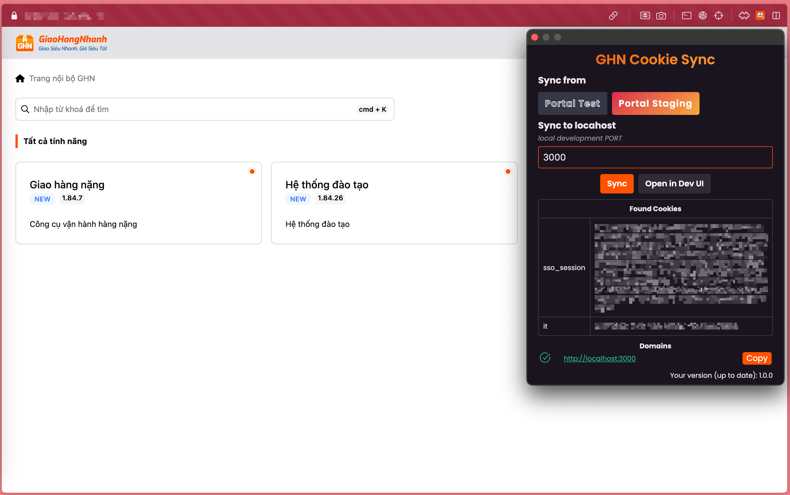

[](https://github.com/comehere127/ghn-sync-cookie/actions/workflows/build.yml)

# GHN Cookie Sync

A browser plugin to automatically sync cookies for local frontend development of GHN. This extension will copy cookies from portal and make them available for your development environment, including version sandbox deployments.



## 🚀 Installation

You can install the latest version of the Cookie Sync extension using the links below:

- [Get GHN Cookie Sync for Firefox](https://addons.mozilla.org/en-US/firefox/addon/ghn-cookie-sync/)

This is the recommended installation method.

## 🔧 Manual Installation

You can download the bundled extension for your browser from the github releases page [here](https://github.com/comehere127/ghn-sync-cookie/releases).

_NOTE: Auto-update will not work with manual installations._

- ### Chromium Based Browsers (Chrome, Edge, Opera)

    1. Visit: [`chrome://extensions`](chrome://extensions) or [`edge://extensions`](edge://extensions) or [`about://extensions`](about://extensions) (in opera).
    2. Enable `Developer Mode`
        - Chrome/Opera: The toggle button is in the top-right corner
        - Edge: The toggle button is in the left sidebar
        - Refresh the page!
    3. Drag & drop the `.zip` file you downloaded into the page.

- ### Firefox

    1. Get an [ESR](https://www.mozilla.org/en-US/firefox/enterprise/), [Developer](https://www.mozilla.org/en-US/firefox/developer/), or [Nightly build](https://www.mozilla.org/en-US/firefox/channel/desktop/#nightly) of firefox.
    2. Follow Mozilla's instructions to enable installing unsigned addons [here](https://support.mozilla.org/en-US/kb/add-on-signing-in-firefox#w_what-are-my-options-if-i-want-to-use-an-unsigned-add-on-advanced-users).
        - Visit [`about:config`](about:config)
        - Set `xpinstall.signatures.required = false`
        - Set `extensions.langpacks.signatures.required = false`
    3. Visit [`about:addons`](about:addons)
    4. Drag & drop the `firefox.xpi` file you downloaded into the page.

- ### Safari

    The full extension is not avaialble on Safari. Instead you can manually read
    cookies from the extension inside Firefox or a Chrome based browser then
    write those cookies into Safari.s

    _Using a browser with this extension installed:_
    1. login to production and also the domain you want to use within Safari.
         - for example, login to [Portal Test](https://test-portal.ghn.tech) or [Portal Staging](https://stg-portal.ghn.tech)  to get refreshed cookies
    2. Open the extension and click "Sync Cookies Now".
    3. Click the "Copy" button next to the domain you want to use within Safari.
    4. Paste the copied `document.cookie=...` snippet into the Safari JavaScript Console.

## 🐛 Bugs

Please file an issue [here](https://github.com/comehere127/ghn-sync-cookie/issues) for feature requests, bugs, missing documentation, or unexpected behavior.

## 🖥️ Developing

Ensure you have:

- [Node.js](https://nodejs.org) 14 or later installed
- [Yarn](https://yarnpkg.com) v1 or v2 installed

Then run the following:

- `yarn install` to install dependencies.
- `yarn run dev:chrome` to start the development server for chrome extension
- `yarn run dev:firefox` to start the development server for firefox addon
- `yarn run build:chrome` to build chrome extension
- `yarn run build:firefox` to build firefox addon
- `yarn run build` builds and packs extensions all at once to `extension/` directory

### Test in Dev Mode

1. `yarn install` to install dependencies.
2. `yarn run dev:chrome` or `yarn run dev:firefox` To watch file changes in development
3. Load the extension in your browser

    _NOTE: Remove any existing versions first_

   #### Chrome

    - Go to the browser address bar and type `chrome://extensions`.
    - Check the `Developer Mode` button to enable it.
    - Click on the `Load Unpacked Extension…` button.
    - Select the folder `cookie-sync/extension/chrome`.

   #### Firefox [ESR](https://www.mozilla.org/en-US/firefox/enterprise/), [Developer](https://www.mozilla.org/en-US/firefox/developer/), or [Nightly build](https://www.mozilla.org/en-US/firefox/channel/desktop/#nightly)

    - Go to the browser address bar and type `about:debugging#/runtime/this-firefox`.
    - Click on the `Temporary Extensions` Section, then the `Load Unpacked Extension…` button.
    - Select the file `cookie-sync/extension/firefox.xpi`.

### Test Prod builds

- `yarn run build` builds the extension for all the browsers.

Note: By default the `package.json` and `manifest.json` are set with version `0.0.0`. The CI pipeline will set the version before building the bundles.

### Generating browser specific manifest.json

Update `source/manifest.json` file with browser vendor prefixed manifest keys

```js
{
  "__chrome__name": "SuperChrome",
  "__firefox__name": "SuperFox",
  "__edge__name": "SuperEdge",
  "__opera__name": "SuperOpera"
}
```

if the vendor is `chrome` this compiles to:

```js
{
  "name": "SuperChrome",
}
```

Add keys to multiple vendors by separating them with | in the prefix

```
{
  __chrome|opera__name: "SuperBlink"
}
```

if the vendor is `chrome` or `opera`, this compiles to:

```
{
  "name": "SuperBlink"
}
```

See the original [README](https://github.com/abhijithvijayan/wext-manifest-loader) of `wext-manifest-loader` package for more details

## License

[MIT ©](https://github.com/comehere127/ghn-sync-cookie/blob/main/LICENCE)

## Inspiration

Inspired by [Sentry Cookie Sync](https://github.com/getsentry/cookie-sync)
